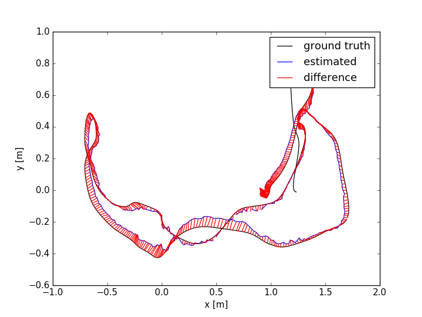

# LDVO - Lightweight Dense Visual Odometry

**LDVO** is a lightweight header-only C++ library for estimating dense visual odometry for RGB-D cameras such as the Microsoft Kinect.

The tracking method implemented in LDVO registers two consecutive RGB-D frames directly upon each other by finding the rigid body transformation that minimizes the photometric error between them.
The camera motion is estimated by embedding a non-linear minimization framework in a coarse-to-fine scheme to support larger motions. 
While this source code is mainly based on [[Steinbruecker et al, ICCVW 2011](https://vision.in.tum.de/_media/spezial/bib/steinbruecker_sturm_cremers_iccv11.pdf)], a robust Huber loss function is added to cope with noise in the input frames.

If you find the LDVO source code useful in your research, please feel free to use the following citations:
```
@inproceedings{steinbruecker2011real,
  title={Real-time visual odometry from dense {RGB-D} images},
  author={Steinbr{\"u}cker, Frank and Sturm, J{\"u}rgen and Cremers, Daniel},
  booktitle={International Conference on Computer Vision Workshops (ICCV Workshops)},
  year={2011}
}
```
```
@misc{ldvo,
  title = {LDVO - Lightweight Dense Visual Odometry},
  author = {Maier, Robert},
  howpublished = "\url{https://github.com/robmaier/ldvo}",
}
```


## Installation
The code was mostly developed and tested on Ubuntu Linux, hence we only provide the build instructions for Ubuntu in the following.
However, the code should also work on other platforms.

Please first clone the source code:
```
git clone https://github.com/robmaier/ldvo.git
```

### Dependencies
LDVO requires
[CMake](https://cmake.org/download/),
[Eigen](http://eigen.tuxfamily.org/),
[OpenCV](http://opencv.org/downloads.html),
[CLI11](https://github.com/CLIUtils/CLI11/) and
[Doxygen](http://www.doxygen.nl/) (with graphviz, optional)
as third-party dependencies.
Eigen and CLI11 are already contained in the ```third_party``` folder; CLI11 is however only required for the example application.
The other dependencies can be installed directly from the default Ubuntu repositories:
```
sudo apt install cmake libopencv-dev doxygen graphviz
```

### Build LDVO
To compile the LDVO including the example application, use the standard CMake approach:
```
mkdir build
cd build/
cmake .. -DCMAKE_BUILD_TYPE=Release
make -j6
```

You can also generate the doxygen documentation, which will be generated in the output folder ```build/doc/html/```:
```
# generate documentation (run from folder build/)
doxygen doc/doxyfile

# open HTML documentation with default application
xdg-open doc/html/index.html
```


## LDVO example application
The LDVO tracker example application ```ldvo_tracker``` allows to estimate the camera trajectories for TUM RGB-D Benchmark sequences.

### Dataset
To get started, download one of the [TUM RGB-D Benchmark sequences](https://vision.in.tum.de/data/datasets/rgbd-dataset/download):
```
# download, unzip and rename freiburg1_desk dataset
cd ../data/
wget https://vision.in.tum.de/rgbd/dataset/freiburg1/rgbd_dataset_freiburg1_desk.tgz
tar -xvzf rgbd_dataset_freiburg1_desk.tgz
mv rgbd_dataset_freiburg1_desk fr1_desk
```

The TUM benchmark also provides several useful tools for working with the datasets, we also download them into ```data/```:
```
wget https://svncvpr.in.tum.de/cvpr-ros-pkg/trunk/rgbd_benchmark/rgbd_benchmark_tools/src/rgbd_benchmark_tools/associate.py
wget https://svncvpr.in.tum.de/cvpr-ros-pkg/trunk/rgbd_benchmark/rgbd_benchmark_tools/src/rgbd_benchmark_tools/evaluate_ate.py
wget https://svncvpr.in.tum.de/cvpr-ros-pkg/trunk/rgbd_benchmark/rgbd_benchmark_tools/src/rgbd_benchmark_tools/evaluate_rpe.py
wget https://svncvpr.in.tum.de/cvpr-ros-pkg/trunk/rgbd_benchmark/rgbd_benchmark_tools/src/rgbd_benchmark_tools/plot_trajectory_into_image.py
```

The color and depth images in the dataset are initially not synchronized, we can associate them using their timestamps and generate the associations file ```fr1_desk/rgbd_assoc.txt```:
```
python associate.py fr1_desk/rgb.txt fr1_desk/depth.txt > fr1_desk/rgbd_assoc.txt
```

As the original datasets do not include the camera intrinsics, we provide the files ```intrinsics_fr1.txt```, ```intrinsics_fr2.txt```, ```intrinsics_fr3.txt``` for the different dataset categories in ```data/```.


## Run the tracker
Finally, let's run the ```ldvo_tracker``` example application on the ```data/fr1_desk``` dataset to estimate the camera trajectory:
```
cd ../build/
./ldvo_tracker -i ../data/fr1_desk/ -c ../data/intrinsics_fr1.txt -p poses.txt --levels 5 --min_level 1 --max_depth 1.5 --update_thres 0.001
```
The parameters used above provide a good trade-off between tracking accuracy and real-time runtimes (~100 fps) on modern hardware.

## Evaluate tracking accuracy
We calculate the camera tracking accuracy and plot the differences between the groundtruth trajectory and the estimated trajectory with the following script:
```
python ../data/evaluate_ate.py ../data/fr1_desk/groundtruth.txt poses.txt --plot plot.png --verbose
```
with output similar to:
```
> compared_pose_pairs 572 pairs
> absolute_translational_error.rmse 0.051186 m
> absolute_translational_error.mean 0.047748 m
> absolute_translational_error.median 0.047048 m
> absolute_translational_error.std 0.018443 m
> absolute_translational_error.min 0.003461 m
> absolute_translational_error.max 0.104978 m
```

The trajectories and differences are plotted in ```plot.png```:




## Integrating LDVO into your project
Since LDVO is a pure header-only C++ library, it can easily be integrated into your own C++ code.

### CMake
Run the following commands to install the LDVO header-only library to a destination folder ```<DIR>``` (without building the examples):
```
cmake .. -DCMAKE_INSTALL_PREFIX=<DIR> -DBUILD_EXAMPLES=OFF -DBUILD_DOCUMENTATION=OFF
make install
```

In order to use LDVO in your project, please include Eigen, OpenCV and LDVO in your ```CMakeLists.txt``` first:
```
# Eigen
# a) include the Eigen headers directly:
#    INCLUDE_DIRECTORIES(${PROJECT_SOURCE_DIR}/third_party/include/)
#    Note: make sure Eigen is in the folder third_party/include/Eigen/
# b) use FIND_PACKAGE to find Eigen, e.g.:
#    FIND_PACKAGE(Eigen REQUIRED)
#    INCLUDE_DIRECTORIES(${EIGEN_INCLUDE_DIR})
#    with 
#    - sudo apt install libeigen3-dev
#    - https://github.com/ceres-solver/ceres-solver/blob/master/cmake/FindEigen.cmake

# OpenCV
FIND_PACKAGE(OpenCV COMPONENTS core highgui imgproc REQUIRED)

# LDVO
FIND_PACKAGE(LDVO REQUIRED)
```

### C++ code snippet
The following C++ code snippet demonstrates the use of the LDVO tracker class and serves as a minimal example, in which only the lines marked with ```// TODO``` need to be completed.
```
#include <ldvo/ldvo.hpp>

...

// configure tracker parameters
ldvo::Tracker::Config tracker_cfg;
// TODO adjust tracker configuration if desired
// validate tracker config to make sure it is valid
tracker_cfg.validate();

// create camera model
// TODO adjust camera parameters
int w = 640;
int h = 480;
Eigen::Matrix3f K;
K << 525.0f, 0.0f, 319.5,
     0.0f, 525.0f, 239.5,
     0.0f, 0.0f, 1.0f;
ldvo::CameraModel camera(w, h, K);

// fill cv::Mat images (OpenCV)
cv::Mat gray_prev, depth_prev;
double time_color_prev, time_depth_prev;
// TODO fill previous frame
cv::Mat gray_cur, depth_cur;
double time_color_cur, time_depth_cur;
// TODO fill current frame

// create and fill previous frame
std::shared_ptr<ldvo::Frame> prev_frame =
        std::make_shared<ldvo::Frame>(w, h);
prev_frame->fill(gray_prev, depth_prev, time_color_prev, time_depth_prev);
// create and fill current frame
std::shared_ptr<ldvo::Frame> cur_frame =
        std::make_shared<ldvo::Frame>(w, h);
prev_frame->fill(gray_cur, depth_cur, time_color_cur, time_depth_cur);

// create and fill image pyramids
int num_levels = tracker_cfg.num_levels;
std::shared_ptr<ldvo::FramePyramid> prev_pyramid =
        std::make_shared<ldvo::FramePyramid>(w, h, num_levels);
prev_pyramid->fill(*prev_frame);
std::shared_ptr<ldvo::FramePyramid> cur_pyramid =
        std::make_shared<ldvo::FramePyramid>(w, h, num_levels);
cur_pyramid->fill(*cur_frame);

// create tracker
ldvo::Tracker tracker(tracker_cfg, camera);

// align previous frame to current frame
Eigen::Matrix4f pose_prev_to_cur = Eigen::Matrix4f::Identity();
bool ok = tracker.align(*prev_pyramid, *cur_pyramid, pose_prev_to_cur);
if (ok)
{
    std::cout << "estimated pose:" << std::endl;
    std::cout << pose_prev_to_cur << std::endl;
}
else
{
    std::cerr << "could not align frames!" << std::endl;
}

...
```
For more details, please refer to the documented source code of the extended example in [```examples/app_tracker.cpp```](examples/app_tracker.cpp).


## License
The LDVO source code is licensed under the [GNU General Public License Version 3 (GPLv3)](http://www.gnu.org/licenses/gpl.html), please see the [LICENSE](LICENSE) file for details.


## Contact
If you have any questions, please contact [Robert Maier &lt;robert.maier@tum.de>](mailto:robert.maier@tum.de).